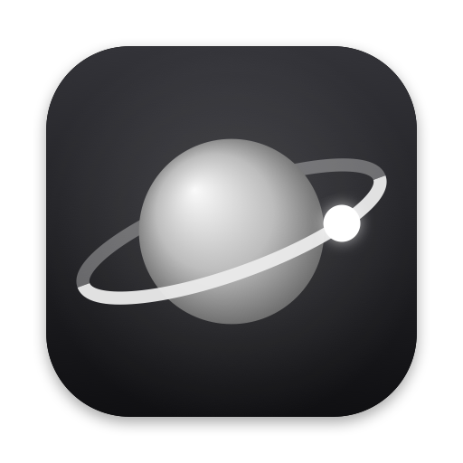
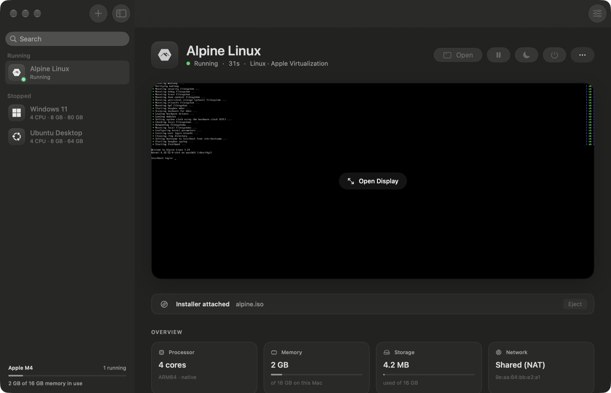
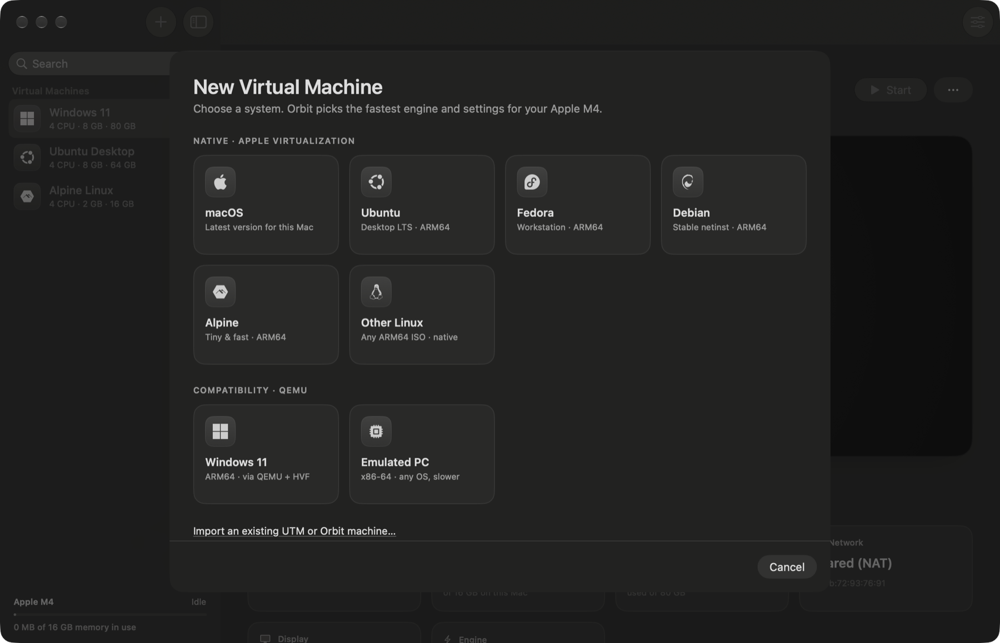
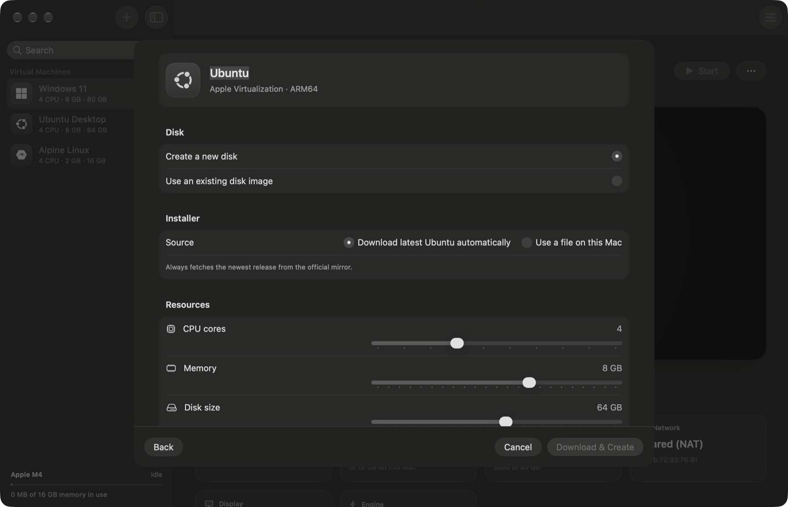
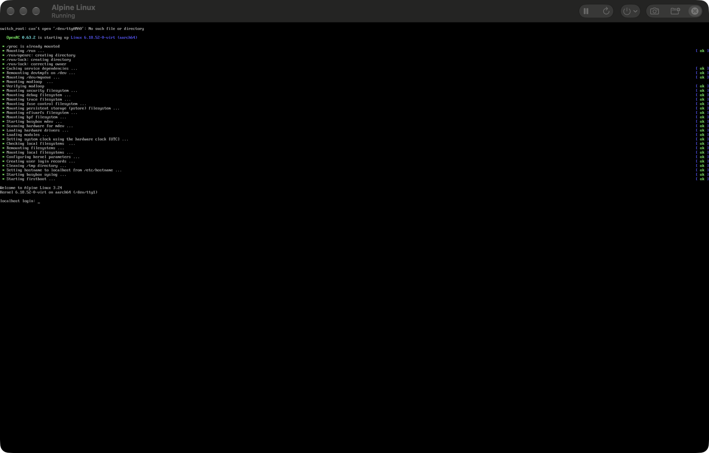
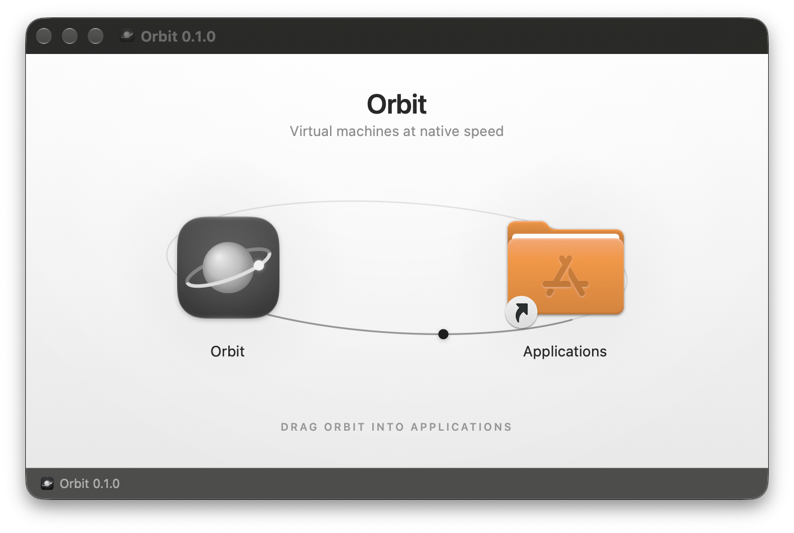

<p align="center">
  
</p>

<h1 align="center">Orbit</h1>

<p align="center">
  <b>Virtual machines at native speed, for Apple Silicon.</b><br>
  macOS, Linux and Windows guests in a quiet, native Mac app.
</p>

<p align="center">
  <a href="https://github.com/BryanParreira/Orbit/releases/latest"><b>Download for Mac</b></a>
  &nbsp;·&nbsp;
  <a href="docs/GUIDE.md">User guide</a>
  &nbsp;·&nbsp;
  <a href="SECURITY.md">Security</a>
  &nbsp;·&nbsp;
  <a href="#build-from-source">Build from source</a>
</p>

<p align="center">
  
  
  
  
</p>

<p align="center">
  
</p>

---

## Why Orbit

**It's fast.** Linux and macOS guests run on Apple's own hypervisor with paravirtual disks, network and graphics. Nothing is emulated unless you ask for it.

**It gets out of the way.** Pick a system and Orbit downloads the newest release, sizes the machine for your Mac and boots it. Two steps, not six.

**It remembers where you were.** Quit with machines running and they're suspended to disk. Next launch, they're back in under a second, mid-task.

**It takes what you already have.** ISOs, macOS restore images, and disks from UTM, VMware, VirtualBox or Hyper-V. Drop them in and Orbit works out the rest.

**It's safe by design.** Downloads are checksum-verified, guests get only what you share, and Orbit never partitions your disks, installs background services or asks for your password.

---

## Create a machine in two steps

<p align="center">
  
</p>

Choose a system, review the settings Orbit picked, and click **Create**.

- **Always the latest release, verified.** Each system is fetched from its official server at the moment you click, so the link is never stale, and checked against the checksum the project publishes before it's used. macOS comes straight from Apple, matched to what your Mac supports.
- **Smart defaults.** Performance cores only, memory sized to leave macOS room to breathe, and disks that take space only as the guest writes.
- **No waiting in a dialog.** The new machine appears in your library immediately, with download speed, time left and install progress on its own page.

<p align="center">
  
</p>

### Supported systems

| Native · Apple Virtualization | Compatibility · QEMU |
|---|---|
| macOS · Ubuntu · Ubuntu Server · Fedora · Debian · **Kali Linux** · Rocky Linux · AlmaLinux · openSUSE Tumbleweed · NixOS · Alpine · any ARM64 Linux ISO | Windows 11 on ARM · FreeBSD · any x86-64 system (emulated) |

---

## Native speed, used well

| | |
|---|---|
| **Apple Virtualization** | macOS and ARM64 Linux guests on Apple's hypervisor, with virtio disks, networking, sound, entropy and memory balloon |
| **Suspend and resume** | Memory is saved on quit and restored on launch. Measured at 0.6 s for a Linux guest on an M4 |
| **Instant snapshots** | APFS clones: a snapshot takes no time and no space until the machine changes. Snapshots taken while running restore to the exact running state |
| **Disposable sessions** | Run on throwaway copies. Close the machine and every change is gone |
| **Instant duplicates** | Clone a machine in a second, with a fresh hardware identity so both can run side by side |
| **Sparse disks** | Apple's ASIF format for native machines, SSD-tuned QCOW2 for QEMU |
| **Rosetta for Linux** | Run x86-64 Linux binaries in ARM guests at near-native speed |
| **Retina-aware text size** | Linux guests look the same size as macOS on a Retina screen, or switch to full Retina sharpness |
| **Nested virtualization** | Run KVM inside Linux guests on M3 and newer |
| **Live shared folders** | Add or remove Mac folders while the guest is running |
| **Disk performance** | Safe, Balanced or Fast, mapped to the hypervisor's sync and cache modes |

When you need something Apple's hypervisor can't run, Orbit switches to **QEMU**: hardware-accelerated for ARM64 guests such as Windows 11, multi-threaded emulation for x86-64. Orbit can install QEMU for you from Settings.

<p align="center">
  
</p>

---

## Bring your own files

Drop a file on the Orbit window, open it from Finder, or choose **File → Import**. Orbit identifies each file by its contents, not its name.

| You bring | Orbit does |
|---|---|
| An installer `.iso` | Creates a machine with it attached, and guesses the system from the file name |
| A macOS `.ipsw` restore image | Creates and installs a macOS machine |
| A disk image: RAW, IMG, uncompressed DMG, ASIF, QCOW2, VMDK, VDI, VHD, VHDX | Creates a machine that boots it. Formats the engine can't read are converted, and your original file is never modified |
| A UTM `.utm` or Orbit `.orbitvm` machine | Imports it as an instant copy. The original keeps working |
| Anything else | Explains why it can't be used and what to do instead |

Existing machines can take an extra disk or a new installer from their settings.

---

## Private and secure

- **No account, no analytics, no tracking.** Orbit goes online only to download systems you ask for and to check for its own updates.
- **Nothing installed on your system.** No helpers, login items or extensions, no administrator password, and it never partitions or formats your Mac's disks. Settings → Storage shows everything Orbit keeps, with sizes.
- **Guests get only what you give them.** Clipboard sharing and the microphone are off by default; shared folders can be read-only.
- **Untrusted machines stay contained.** Packages from elsewhere can't reach files outside themselves and start without shared folders.

Read the full [security model](SECURITY.md).

---

## Always up to date

Orbit updates itself. When a new version is published it shows up in **Orbit → Check for Updates…**, or in the background once a day if you leave that on. Updates are verified with an EdDSA signature before anything is installed, replace the app in place, and never touch your machines. Running machines are suspended before the update and resume afterwards.

---

## Install

<p align="center">
  
</p>

1. Download **Orbit.dmg** from the [latest release](https://github.com/BryanParreira/Orbit/releases/latest).
2. Open it and drag **Orbit** into **Applications**.

Orbit is signed with a Developer ID and notarized by Apple, so it opens without warnings.

**Requirements:** a Mac with Apple Silicon running macOS 26 or later. QEMU is optional and only needed for Windows, FreeBSD and x86-64 guests.

New to virtual machines? The **[user guide](docs/GUIDE.md)** walks through everything, from your first machine to shared folders, Windows 11 and uninstalling. It's also in Orbit's **Help** menu.

---

## Build from source

```sh
brew install xcodegen
git clone https://github.com/BryanParreira/Orbit.git && cd Orbit
xcodegen generate
open Orbit.xcodeproj        # then press ⌘R
```

Development builds are signed to run locally with the `com.apple.security.virtualization` entitlement, so no Apple Developer account is needed. Updates are turned off in these builds.

Run the tests:

```sh
xcodebuild test -project Orbit.xcodeproj -scheme Orbit
```

<details>
<summary><b>Project layout</b></summary>

```
Orbit/
  App/          entry point, commands, quit handling, DEBUG self-tests
  Model/        configuration, live VM state, library, snapshots, UTM import
  Engine/
    Apple/      Virtualization.framework backend (adapted from UTM)
    QEMU/       argument builder, QMP client, process backend
  Services/     host info, disk images and conversion, file inspection,
                downloads, OS catalog, VM creation, updater
  UI/           library, detail page, wizard, settings, display, menu bar
OrbitTests/     format detection, conversion, UTM import, QEMU arguments
Config/         version, team, GitHub repo, update feed, Sparkle public key
Distribution/   DMG artwork, export options
Scripts/        release pipeline, artwork generators
```

Each machine is a `.orbitvm` package in `~/Library/Application Support/Orbit/Virtual Machines`, holding `config.json`, its disks, firmware, saved state and snapshots. The location can be changed in Settings.

</details>

---

## Releasing

One command builds, signs, notarizes, packages and publishes a release, and updates the feed every installed copy of Orbit checks.

```sh
Scripts/release.sh 0.2.0 --notes notes.md
```

It archives a Release build, signs it with your Developer ID (hardened runtime, secure timestamp), notarizes and staples the app, builds the installer DMG, notarizes and staples that too, signs the update with your Sparkle key, regenerates `appcast.xml` (keeping every earlier release), and creates the GitHub release with both files attached.

| Option | |
|---|---|
| `--notes FILE` | Markdown release notes, shown to users in the update window |
| `--draft` | Publish as a GitHub draft. Drafts are invisible to the updater until you publish them |
| `--skip-notarize` | Faster local build for testing. Other Macs will block it |
| `--no-publish` | Build everything but don't upload |
| `--plain-dmg` | Skip the styled DMG window, for machines where Finder automation isn't allowed |

<details>
<summary><b>One-time setup</b></summary>

1. **Developer ID certificate.** A *Developer ID Application* certificate for team `5PNLAR99PK` in your login Keychain (already installed on this Mac).

2. **Notarization credentials.** Create an app-specific password at [account.apple.com](https://account.apple.com), then store it once:

   ```sh
   xcrun notarytool store-credentials orbit-notary \
       --apple-id YOUR_APPLE_ID --team-id 5PNLAR99PK
   ```

3. **GitHub repository.**

   ```sh
   gh repo create BryanParreira/Orbit --public --source . --push
   ```

4. **Update signing key.** Orbit's EdDSA key was created with Sparkle's `generate_keys --account orbit`; the private half is in your login Keychain and the public half is in `Config/Orbit.xcconfig`. Back up the private key somewhere safe. If it's lost, installed copies can never accept another update.

   ```sh
   build/DerivedData/SourcePackages/artifacts/sparkle/Sparkle/bin/generate_keys --account orbit -x orbit-update-key.txt
   ```

The version, team, repository and feed URL all live in [`Config/Orbit.xcconfig`](Config/Orbit.xcconfig). The release script sets the version and a new, always-increasing build number, so commit that file after each release.

</details>

---

## Status

Orbit is an early release. Linux guests (created, downloaded, imported and converted), suspend and resume, snapshots, disposable sessions and the QEMU engine have all been tested end to end. macOS and Windows 11 guests are implemented but haven't yet been through a full install. Bridged networking requires Apple's restricted networking entitlement and is unavailable in public builds.

## Credits

Orbit's virtualization engine is adapted from [UTM](https://github.com/utmapp/UTM) by osy and contributors, under the Apache License 2.0. See [`NOTICE`](NOTICE) and [`ThirdParty/UTM-LICENSE.txt`](ThirdParty/UTM-LICENSE.txt). Updates are delivered with [Sparkle](https://sparkle-project.org). OS logos are from [Simple Icons](https://simpleicons.org) (CC0) and belong to their respective owners.
